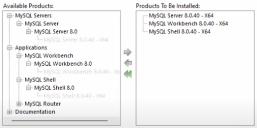

1. See if MySQL installed. If yes GOTO step 11. Else GOT step 2

2. Download from: https://dev.mysql.com/get/Downloads/MySQLGUITools/mysql-workbench-community-8.0.42-winx64.msi

3. Once downloaded start the installing.

4. From the available products, click on + of each till all plus are clicked (even the nested), select on the the program which is the latest and click on the green rightside facing arrow individually to install the products.

5. There should be 6 total to be installed ones at the end (also counting the documentationa and samples) (refer image.png, only 3 are here coz space issue)

6. Click on Next then Execute then wait for the installation (takes a while. Tab tk baaju waale ko poocho kya chal raha sab theek hai? khayal rakha karo baaju waalo ka)

7. Click on next, next, note the port (3306 by default, ladkiya chedo iss port number ko nahi)

8. Next, next, select password and since college ki property use 1234. Next next execute, finosh next, next, type password, click on check, next, next, finish... keep going till a command prompt pens up in which type \quit to exit

9. Open file explorer, go to c drive, program files, MYSQL, server, bin. Copy the file address.

10. Serch edit system environment variables, open it, click on environment varibles,  In the system variable section, double click on Path, double click on the empty line and paste the path copied (C:\Program Files\MySQL\MySQL Server 8.0\bin in my case). Click ok and close.

11. open workbench as admnistrator

12. New connection. Ensure the connection is Standard tcp/ip. Save the password in the vault by clicking the option.

13. Create server. Now At the far right see Administrator and schema options, go to schemas and then right click on the world shcema
and click on Set as default.

14. Go to powerbi, get data, more, search for mysql connect.

14.1 If additional required, install this: https://dev.mysql.com/get/Downloads/Connector-Net/mysql-connector-net-9.3.0.msi
14.2 Relaunch powerbi and do step 14

15. Server is localhost database is optional (if still asked try worlds or city) ok then load

16. Look at the "Visualization" at the left screen. If already opened continue, elif clic on the "<<" to open it

17. There are two options to be selected there (One image consists of two rectangles dot line sepersted and other is a page with paint brush, choose the rectangle one [it is also chosen by default])

18. Choose any graph of your liking (dont go over the board, only choose of those which you know already. Jada failne ki zaroorat nahi).

19. Once chosen it will appear on the left of your dashboard and below te graph options X-axis and Y-axis and such thing (depending upon the graph chosen will appear)

20. Similar to step 6 there is "Data" present. To access click on ">" at the left of the working sheet. A dropdown will come.

21. Drag the value in the X-axis and Y-axis to create the visualizations.

22. Create multiple beutiful visuals because you have 1 hour and timepass karna hai.

Kaam khatam bhaago yaha se